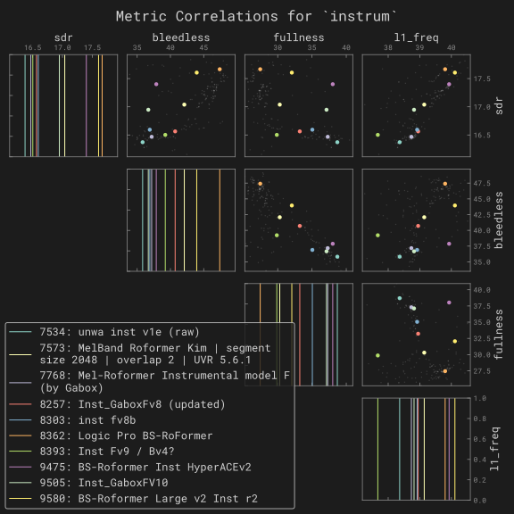

More information on the expected JSON schema for the configuration can be found in [`splifft.config.Config`][].

## Supported models

### BS Roformer

This is an audio-to-audio spectrogram-masking model.

- [`config.model`][splifft.models.bs_roformer.BSRoformerParams]
- [`config.model_type = "bs_roformer" or "mel_roformer"`][splifft.config.Config.model_type]

In `splifft`, Mel Roformers falls under the BS Roformers categority, with the [`splifft.models.bs_roformer.MelBandsConfig`][] field present and set.

### MDX23C

- [`config.model`][splifft.models.mdx23c.MDX23CParams]
- [`config.model_type = "mdx23c"`][splifft.config.Config.model_type]

#### Visualizations

The following are quick comparisons for the quality of different models, as evaluated on MVSep.

<!--
https://github.com/undef13/splifft/blob/main/scripts/mvsep.py
uv run scripts/mvsep.py correlations --instruments instrum --id 7534 --id 7573 --id 7768 --id 8257 --id 8303 --id 8393 --id 8362 --id 9505 --id 9475 --id 9580
uv run scripts/mvsep.py correlations --instruments vocals --id 7475 --id 7706 --id 8093 --id 8265 --id 8337 --id 8377 --id 9470
-->

=== "Instrumental"

    

=== "Vocals"

    

### Beat This

This is an audio-to-signal model. The output is a continuous activation curves where peaks represent beat candidates (logits) at 50 Hz.

- [`config.model`][splifft.models.beat_this.BeatThisParams]
- [`config.model_type = "beat_this"`][splifft.config.Config.model_type]

The reference package `beat_this` depends on `madmom.features.downbeats.DBNDownBeatTrackingProcessor` as a preprocessing step, which uses:

- a state space to represent progression through a measure. for a 4/4 time signature, states represent grid positions (e.g. "beat 1, 25% through")
- transition model encodes tempo (bpm) and continuity, penalising sudden tempo jumps
- observation model takes the raw logit values (activations) as input probabilties
- using a Viterbi-like algorithm to find the most likely path through states

However [`madmom` has been abandoned as of 2024-08-25](https://github.com/CPJKU/madmom/issues/553) and so we do not depend on it.
